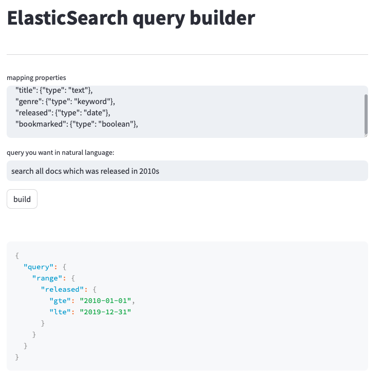

# Elasticsearch query builder

Simple ElasticSearch query builder powered by ChatGPT. Just specify fields you have and describe what you want to query, then it will give you corresponding Elasticsearch query.

### how to run
Add `OPENAI_API_KEY` to your .env file before run

```bash
streamlit run main.py
```

### example
